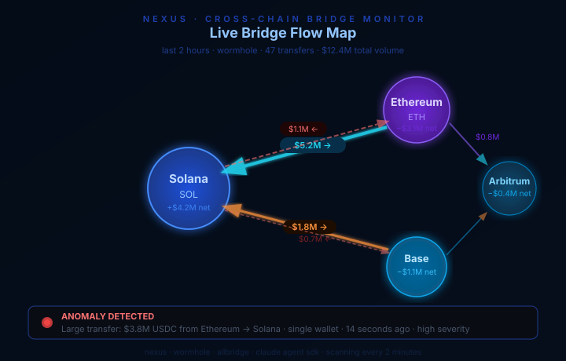
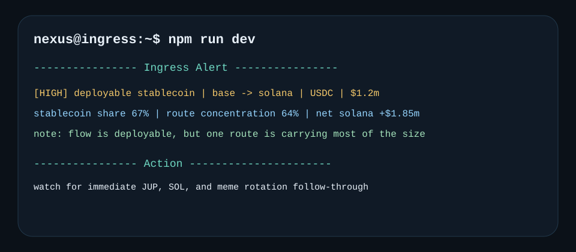

# Nexus

Bridge-ingress radar for Solana capital flows.

Spot the bridge flows that actually land on Solana with deployable capital behind them.

`bun run dev`

- watches landed size, stablecoin share, corridor concentration, and landing quality
- ignores circular bridge churn and parked inventory that never turns into positioning
- promotes inbound capital that still looks deployable after it reaches Solana

[](https://github.com/NexusSOL/Nexus/actions)


## Ingress Console



## Ingress Alert



## Operating Surfaces

- `Topline`: compresses landed flow, stablecoin share, corridor share, and status into one strip
- `Route Leaderboard`: ranks the corridors carrying deployable capital into Solana
- `Landing Quality`: separates ready capital from idle bridge inventory
- `Ingress Alert`: prints the actual event the operator sees when a route is promoted

## Why Nexus Exists

Large bridge transfers are noisy on their own. The real question is whether capital is moving into Solana in a form that can be deployed quickly into memes, DeFi, or funding rotations.

## What Counts As Real Ingress

Nexus treats deployable stablecoin flow very differently from capital that is only passing through. A large bridge transfer can still be useless if it is parking, roundtripping, or crowding into one corridor that everyone else is already watching.

The console is trying to answer one narrow question: if this size landed on Solana, does it still look like capital that can rotate into the market now?

## How The Console Is Read

- `Topline` tells you whether the board should matter at all
- `Route Leaderboard` shows which corridor is carrying the real size
- `Landing Quality` tells you whether that size still looks usable
- `Ingress Alert` is the moment an operator would actually escalate the event

## Technical Spec

### Core Metrics

- `netUsd = inboundUsd - outboundUsd`
- `stablecoinSharePct = stablecoinInboundUsd / inboundUsd`
- `routeConcentrationPct = largestInboundRouteUsd / inboundUsd`

### Detection Logic

- High `netUsd` into Solana with high `stablecoinSharePct` implies deployable capital.
- High `routeConcentrationPct` means the event may be route-specific and crowded.
- Rapid roundtrip behavior lowers conviction because it often reflects inventory management or arb.

### Anomaly Types

- `solana_ingress`: broad inbound capital to Solana
- `deployable_stablecoin`: inbound flow dominated by stablecoins
- `route_concentration`: one route is carrying most of the flow
- `roundtrip_churn`: bridge activity looks transient rather than committed
- `suspicious_timing`: concentrated flow before a catalyst window

## Why Nexus Matters

When Solana turns active, bridge dashboards get noisy fast. Nexus is deliberately opinionated about what matters because non-deployable flow wastes attention.

It is better to miss a harmless bridge blip than to promote parked inventory as if it were real market fuel.

## Quick Start

```bash
git clone https://github.com/NexusSOL/Nexus
cd Nexus
npm install
cp .env.example .env
npm run dev
```

## Configuration

```bash
ANTHROPIC_API_KEY=sk-ant-...
WORMHOLE_API_KEY=...
LARGE_TRANSFER_THRESHOLD_USD=500000
MIN_SOLANA_INGRESS_USD=1000000
DEPLOYABLE_STABLECOIN_SHARE_PCT=45
ROUTE_CONCENTRATION_THRESHOLD_PCT=62
SCAN_INTERVAL_MS=120000
```

## Local Audit Docs

- [Commit sequence](docs/commit-sequence.md)
- [Issue drafts](docs/issue-drafts.md)

## Support Docs

- [Runbook](docs/runbook.md)
- [Changelog](CHANGELOG.md)
- [Contributing](CONTRIBUTING.md)
- [Security](SECURITY.md)

## License

MIT
