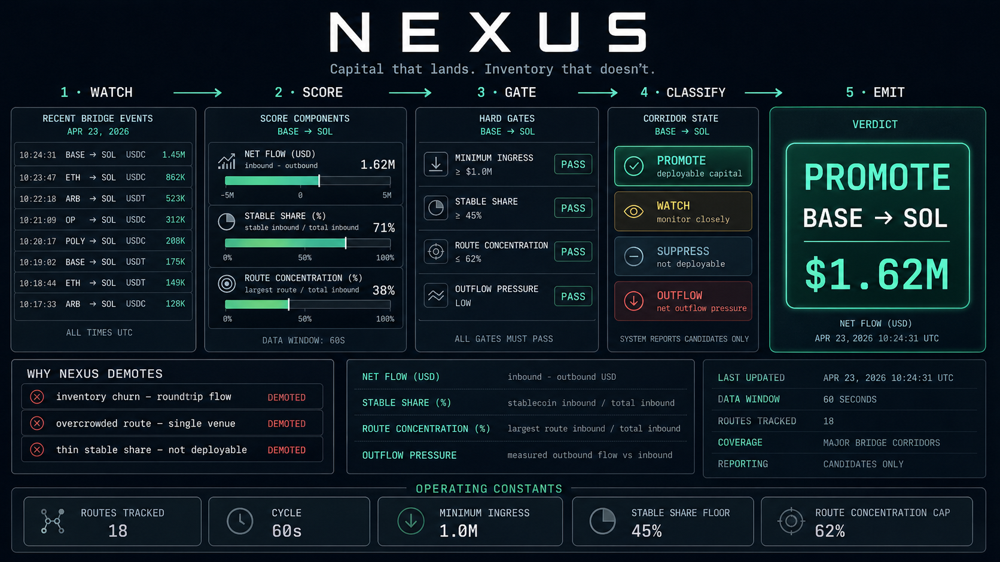

# Nexus

Bridge-ingress radar for Solana capital flows.

Spot the bridge flows that actually land on Solana with deployable capital behind them.

`bun run dev`

- watches landed size, stablecoin share, corridor concentration, and landing quality
- ignores circular bridge churn and parked inventory that never turns into positioning
- promotes inbound capital that still looks deployable after it reaches Solana

[](https://github.com/NexusSOL/Nexus/actions)


Live Solana Ingress Console • Operating Surfaces • Why Nexus Exists • Real Ingress • Technical Spec • Quick Start

## At a Glance

- `Use case`: filter bridge noise into deployable Solana ingress
- `Primary input`: landed size, stablecoin share, corridor concentration, landing quality
- `Primary failure mode`: confusing parked bridge inventory with real market fuel
- `Best for`: operators tracking whether capital is arriving in a usable form

## Live Solana Ingress Console



Live operating view for Nexus: route leaderboard across cross-chain corridors, live bridge-flow feed, selected corridor detail with stable share and route concentration, net-flow chart, guardrails, and the agent's current PROMOTE, WATCH, SUPPRESS, or OUTFLOW decision.

## Operating Surfaces

- `Topline`: compresses landed flow, stablecoin share, corridor share, and status into one strip
- `Route Leaderboard`: ranks the corridors carrying deployable capital into Solana
- `Landing Quality`: separates ready capital from idle bridge inventory
- `Ingress Alert`: prints the actual event the operator sees when a route is promoted

## What Nexus Watches That Other Dashboards Ignore

Most bridge boards are happy to tell you that capital moved. That is not enough. Big transfers can be inventory management, arb routing, exchange reshuffling, or capital that never actually expresses itself inside Solana after landing.

Nexus is more selective. It wants to know whether the flow arrived in a form that still looks usable by the time it reaches Solana. That means stablecoin-heavy, low-churn, and not obviously trapped inside one crowded corridor.

## Why Nexus Exists

Large bridge transfers are noisy on their own. The real question is whether capital is moving into Solana in a form that can be deployed quickly into memes, DeFi, or funding rotations.

## What Counts As Real Ingress

Nexus treats deployable stablecoin flow very differently from capital that is only passing through. A large bridge transfer can still be useless if it is parking, roundtripping, or crowding into one corridor that everyone else is already watching.

The console is trying to answer one narrow question: if this size landed on Solana, does it still look like capital that can rotate into the market now?

## How The Console Is Read

- `Topline` tells you whether the board should matter at all
- `Route Leaderboard` shows which corridor is carrying the real size
- `Landing Quality` tells you whether that size still looks usable
- `Ingress Alert` is the moment an operator would actually escalate the event

## How It Works

Nexus processes ingress in a straightforward order:

1. measure inbound and outbound bridge flow around Solana
2. isolate the corridors carrying the meaningful size
3. check how much of that inbound flow is stablecoin-dominant
4. discount transfers that look circular, parked, or overly crowded
5. promote the routes that still look deployable after landing

The key distinction is not whether capital moved. It is whether the capital still matters once it is on Solana.

## Typical Operator Questions

Nexus is useful when the market starts asking questions like:

- is this capital really landing on Solana, or only touching it briefly
- is the inbound flow mostly stablecoins or mostly inventory
- is one route becoming so crowded that the signal is losing value
- does the landed capital still look deployable into the market now

Those are better questions than simply watching gross bridge size.

## Example Output

```text
NEXUS // INGRESS ALERT

lead corridor      BASE -> SOL
net landed flow    $1.85m
stablecoin share   67%
corridor share     64%
landing quality    ready to deploy

operator note: inbound capital looks usable, but monitor corridor crowding on the next cycle
```

## Technical Spec

### Core Metrics

- `netUsd = inboundUsd - outboundUsd`
- `stablecoinSharePct = stablecoinInboundUsd / inboundUsd`
- `routeConcentrationPct = largestInboundRouteUsd / inboundUsd`

### Detection Logic

- High `netUsd` into Solana with high `stablecoinSharePct` implies deployable capital.
- High `routeConcentrationPct` means the event may be route-specific and crowded.
- Rapid roundtrip behavior lowers conviction because it often reflects inventory management or arb.

### Anomaly Types

- `solana_ingress`: broad inbound capital to Solana
- `deployable_stablecoin`: inbound flow dominated by stablecoins
- `route_concentration`: one route is carrying most of the flow
- `roundtrip_churn`: bridge activity looks transient rather than committed
- `suspicious_timing`: concentrated flow before a catalyst window

## What A Strong Nexus Alert Looks Like

- net Solana inflow is meaningfully positive
- stablecoin share is high enough to imply usable dry powder
- the lead corridor is clear, but not so dominant that it looks crowded
- landing quality still looks good after the transfer settles

If those conditions are not present, the board should downgrade the event quickly.

## Risk Controls

- `stablecoin quality gate`: discounts inbound flow that arrives as non-deployable inventory
- `corridor concentration cap`: prevents one overheated route from being treated as clean signal
- `roundtrip churn filter`: rejects capital that is only touching Solana briefly
- `landing quality filter`: requires the flow to still look usable after arrival

Nexus is supposed to miss noisy transfers on purpose. A false ingress read wastes attention exactly when the market is busiest.

## Why Nexus Matters

When Solana turns active, bridge dashboards get noisy fast. Nexus is deliberately opinionated about what matters because non-deployable flow wastes attention.

It is better to miss a harmless bridge blip than to promote parked inventory as if it were real market fuel.

## Quick Start

```bash
git clone https://github.com/NexusSOL/Nexus
cd Nexus
npm install
cp .env.example .env
npm run dev
```

## Configuration

```bash
ANTHROPIC_API_KEY=sk-ant-...
WORMHOLE_API_KEY=...
LARGE_TRANSFER_THRESHOLD_USD=500000
MIN_SOLANA_INGRESS_USD=1000000
DEPLOYABLE_STABLECOIN_SHARE_PCT=45
ROUTE_CONCENTRATION_THRESHOLD_PCT=62
SCAN_INTERVAL_MS=120000
```

## Local Audit Docs

- [Commit sequence](docs/commit-sequence.md)
- [Issue drafts](docs/issue-drafts.md)

## Support Docs

- [Runbook](docs/runbook.md)
- [Changelog](CHANGELOG.md)
- [Contributing](CONTRIBUTING.md)
- [Security](SECURITY.md)

## License

MIT
